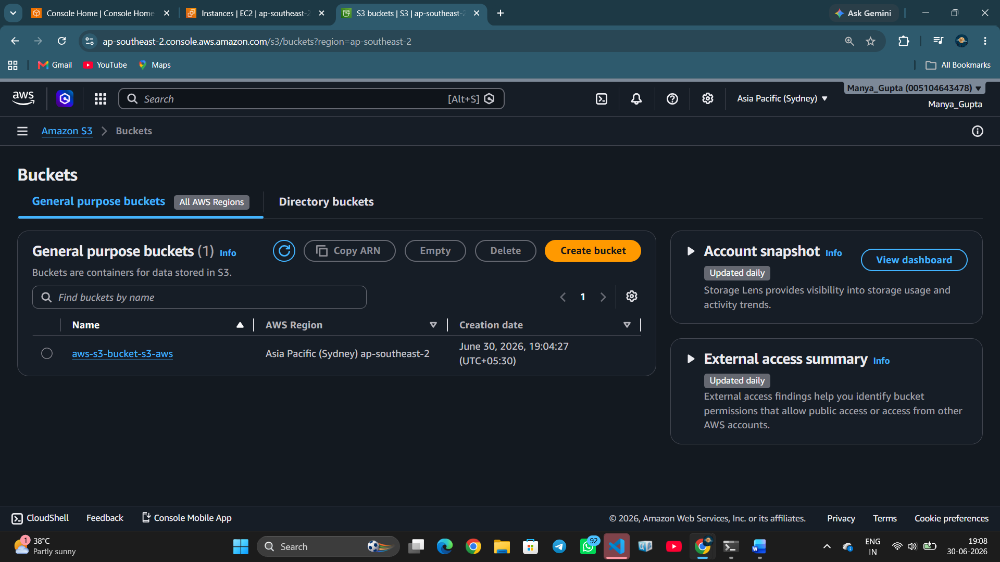
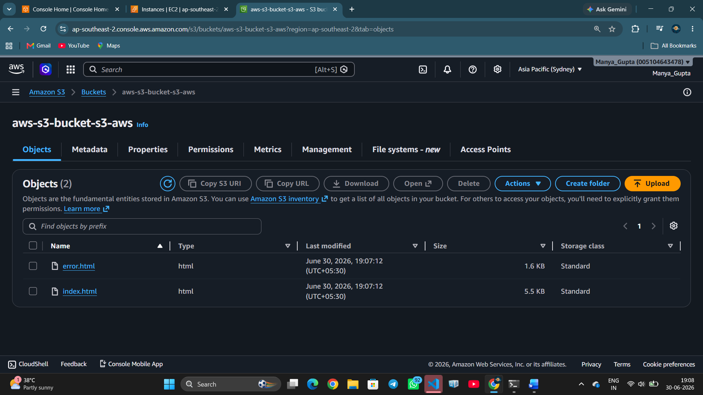
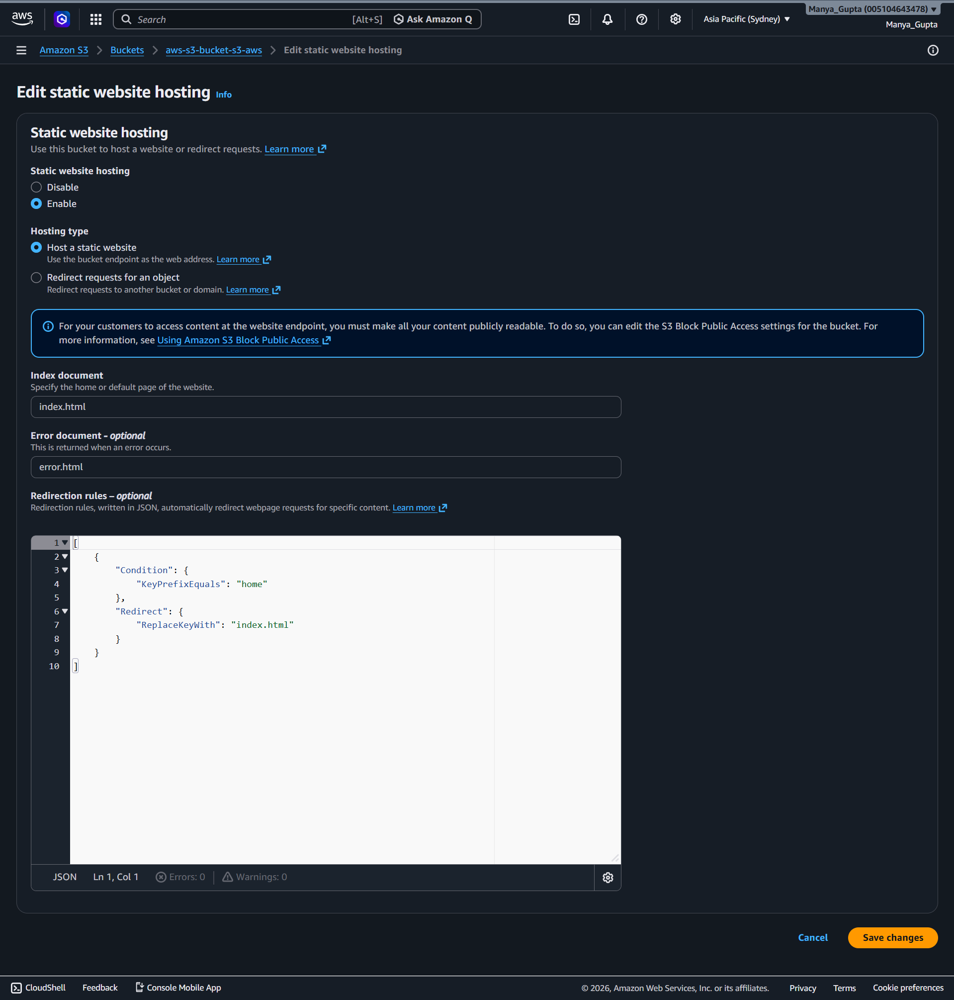
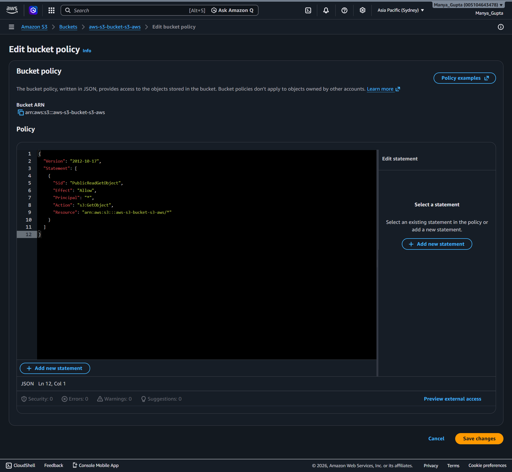

# AWS S3 Static Website Hosting

## Project Overview

This project demonstrates how to host a static website using Amazon S3 Static Website Hosting. The website is built with HTML, CSS, and JavaScript and deployed on AWS without the need for a traditional web server. The project showcases the fundamentals of cloud-based website hosting, including bucket configuration, public access management, and static website deployment.

---

## Features

- Hosted a static website on Amazon S3
- Responsive user interface built with HTML, CSS, and JavaScript
- Configured S3 Static Website Hosting
- Enabled public access using bucket policies
- Custom error page support
- Simple and cost-effective deployment

---

## Technologies Used

- Amazon S3
- AWS Management Console
- HTML5
- CSS3
- JavaScript

---

## Architecture

The following diagram illustrates the architecture of the AWS S3 Static Website Hosting project.


---

## Project Structure

```text
aws-s3-static-website-hosting/
│
├── index.html
├── error.html

├── screenshots/
│   ├── bucket_image.png
    ├── files_in_bucket.png
    ├── web_hosting_edit.png
│   ├── static-hosting.png
│   ├── bucket-policy.png
│   └── hostindex.png
└── README.md
```

---

## Deployment Steps

### Step 1: Create an Amazon S3 Bucket

- Sign in to the AWS Management Console.
- Open Amazon S3.
- Create a bucket with a globally unique name.

### Step 2: Upload Website Files

Upload all website files including:

- HTML files
- CSS files
- JavaScript files
- Images

### Step 3: Disable Block Public Access

Disable the **Block Public Access** settings to allow the website to be accessed publicly.

### Step 4: Configure Bucket Policy

Add a bucket policy to grant public read access to the objects stored in the bucket.

### Step 5: Enable Static Website Hosting

Enable **Static Website Hosting** in the bucket properties.

Configuration:

- Index document: `index.html`
- Error document: `error.html`

### Step 6: Access the Website

Open the S3 Static Website Endpoint provided by AWS in your browser.

---


## Screenshots

### S3 Bucket


### Files in S3 Bucket


### Static Website Hosting Configuration


### Static Website Endpoint


### Bucket Policy


### Hosted Website


## Learning Outcomes

Through this project, I learned how to:

- Create and configure Amazon S3 buckets
- Enable Static Website Hosting
- Configure bucket policies for public access
- Deploy a static website on AWS
- Understand cloud-based website hosting
- Manage website files using Amazon S3
